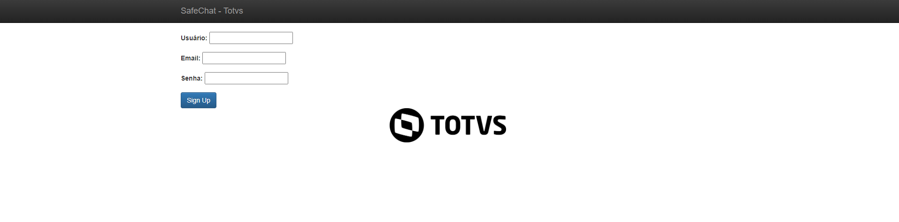
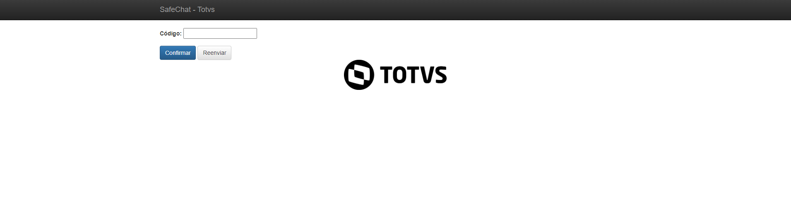
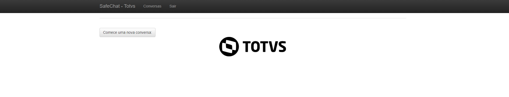
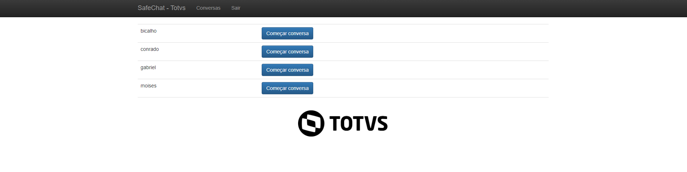
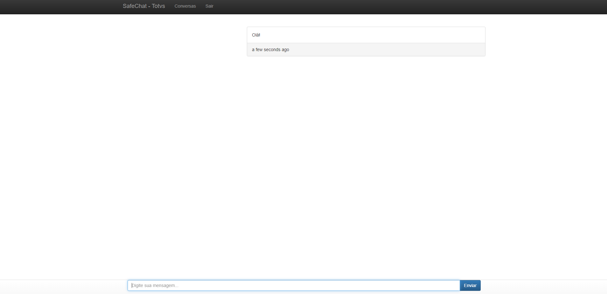
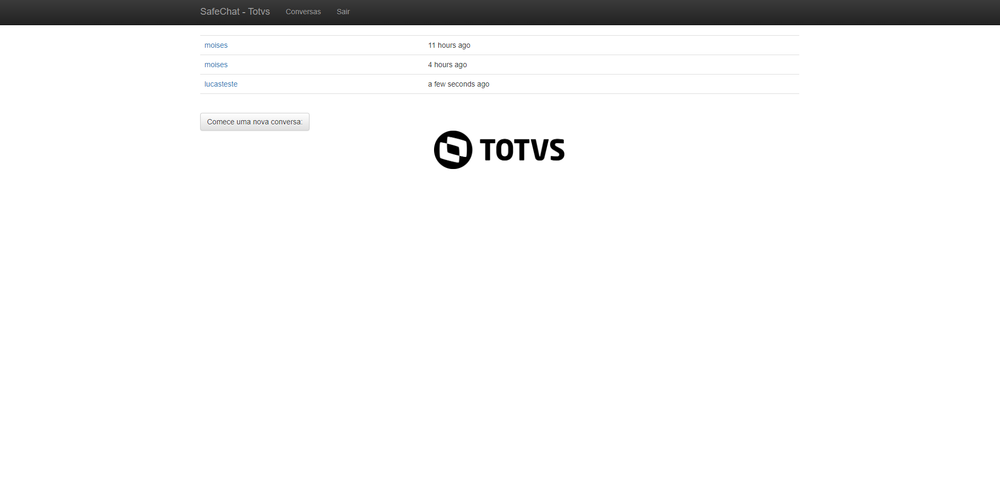
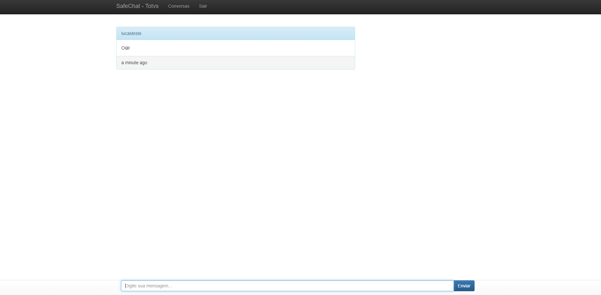

<h1 align="center">:file_cabinet: SafeChat - Totvs</h1>

## :memo: Descrição
O SafeChat foi criado com o objetivo de ser um sistema de conversas, um aplicativo de chat, para a troca de informações entre o suporte e o cliente que depende de um sistema. 
O chat foi desenvolvido para facilitar essa comunicação, tinha como objetivo ser feito em uma estrutura Serverless e utilizar os serviços de nuvem para sua execução.

*<b>Link de acesso:</b> http://lucas-projetochat-v1-1873.s3-website-us-east-1.amazonaws.com/

## :books: Funcionalidades
* <b>Login e registro</b>: Utilizando do Cognito AWS, foi criada a função de login e registro de usuários, para controle de quem acessa o sistema, já que a ideia era ser um chat para os funcionários de suporte e os usuários.
* <b>Mensagens</b>: A aplicação, utilizando o banco de dados DynamoDB AWS, salva as conversas, relacionando-as com os usuários dessa conversa, com isso é possível que cada usuário abra a conversa e tenha um chat em tempo real com outro usuário. 

## :wrench: Tecnologias utilizadas
* JavaScript;
* CSS3;
* NodeJS;
* HTML5;
* Bootstrap 5;
* AWS Services;

## :rocket: Rodando o projeto
* Página inicial

* Cadastro

* Verificação

* Novo Usuário

* Nova Conversa

* Mensagem

* Outro usuário

* Conversa simultânea

## :soon: Implementação futura
* Infelizmente não foi possível a implementação da função de apagar as mensagens.
Seria feita essa função, que, sempre que o usuário deslogasse, ou por meio de um botão na conversa, ele poderia apagar as mensagens. Assim, todas as senhas e informações sensíveis que foram enviadas, seriam apagadas, sem salvar histórico.

## :dart: Status do projeto
* Parcialmente completo.
